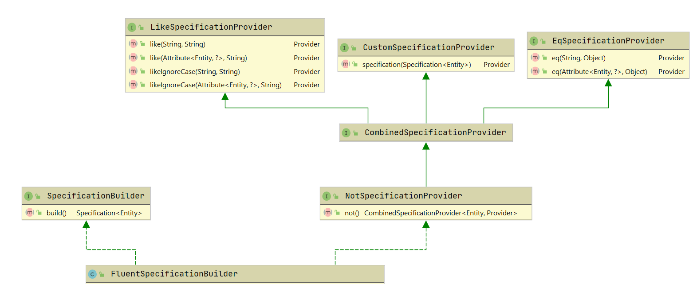

# Spring Data Specification Builder
Spring boot library that provides fluent API to define and compose specifications for data querying.

## Table of contents
* [Quick start](#quick-start)
* [Status](#status)
* [Usage](#usage)

## Quick start

Maven:
```xml
<dependency>
    <groupId>com.kirekov</groupId>
    <artifactId>spring-data-specification-builder</artifactId>
</dependency>
```

Gradle:
```groovy
dependencies {
    implementation 'com.kirekov:spring-data-specification-builder'
}
```

## Status

[](https://travis-ci.com/SimonHarmonicMinor/spring-data-specification-builder)
[](https://sonarcloud.io/dashboard?id=spring-data-specification-builder)
[](https://sonarcloud.io/dashboard?id=spring-data-specification-builder)
[](https://sonarcloud.io/dashboard?id=spring-data-specification-builder)
[](https://sonarcloud.io/dashboard?id=spring-data-specification-builder)

## Usage 
<sup>[back to table of contents](#table-of-contents)</sup>
* [Basic](#basic)
* [Advanced](#advanced)

### Basic
```java
Specification<Student> spec = FluentSpecificationBuilder
                     .combinedWithAnd()
                     .like("name", "%imo%")
                     .eq("age", 18)
                     .build();
List<Student> students = studentRepository.findAll(spec);
```

It is recommended to use [hibernate-jpamodelgen](https://hibernate.org/orm/tooling/) in order to auto generate field names.
The query would like this.

```java
Specification<Student> spec = FluentSpecificationBuilder
                     .combinedWithAnd()
                     .like(Student_.NAME, "%imo%")
                     .eq(Student_.AGE, 18)
                     .build();
List<Student> students = studentRepository.findAll(spec);
```

By the way, the library supports type-safe links `Attribute<Entity, ?>`. So, the query can be enhanced with type checking.

```java
Specification<Student> spec = FluentSpecificationBuilder
                     .combinedWithAnd()
                     .like(Student_.name, "%imo%")      // compiles only with Attribute<Student, ?>
                     .eq(Student_.age, 18)              // same
                     .build();
List<Student> students = studentRepository.findAll(spec);
```

### Advanced
<sup>[back to usage](#usage)</sup>
* [Architecture](#architecture)
* [Complex queries](#complex-queries)
#### Architecture



`FluentSpecificationBuilder` is the entry point to the library and the only public implementation.

### Complex queries
<sup>[back to advanced](#advanced)</sup>

The defined conditions can be applied with either `&&` or `||` logical expressions.

```java
final var builderAnd = FluentSpecificaitonBuilder.<Student>combinedWithAnd();
final var builderOr = FluentSpecificaitonBuilder.<Student>combinedWithOr();
```

More than that, you can invert any condition with `not()`. Note that `not()` strictly requires condition.
You can't build the specification with unclosed `not()`.

```java
final var spec = FluentSpecificationBuilder
                     .<Student>combinedWithAnd()
                     .like(Student_.name, "%a%")
                     .not().eq(Student_.age, 22)
                     .build();
```

If you have to provide complex condition that cannot be interpreted with the library, you can use `specification()` method.

```java
final var spec = FLuentSpecificationBuilder()
                     .<Student>combinedWithAnd()
                     .eq(Student_.age, 20)
                     .specification((root, query, criteriaBuilder) -> /* your custom specification */)
                     .build();
```

That is also means that you can combine the results of different builders.
```java
final var spec = FluentSpecificationBuilder()
                     .<Student>combinedWithOr()
                     .specification(
                         FluentSpecificationBuilder()
                             .<Student>combinedWithOr()
                             /* conditions */
                             .build()
                     )
                     .specification(
                         FluentSpecificationBuilder()
                             .<Student>combinedWithAnd()
                             /* conditions */
                             .build()
                     )
                     .build();
```

If you need to specify a field in a child entity, you can use `PathFunction`.

```java
final var spec = FluentSpecificationBuilder
                     .<Student>combinedWithAnd()
                     .like(Student_.name, "%a%")
                     .not().eq(root -> root.get(Student_.university).get(University_.name), "MIT")
                     .buildDistinct();
```